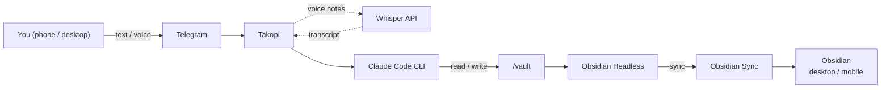

# Obsidian Telegram Agent

A Telegram bot that gives Claude Code read/write access to your Obsidian vault.

[](LICENSE)
[](docker-compose.yml)
[](https://docs.anthropic.com/en/docs/claude-code)

Forward a link to save an article. Send a voice note on the go. Ask it to clean up old project notes. No app-switching, no copy-pasting — just message the bot.

The whole point: **one command on a VPS** and you get a Telegram bot, a real Obsidian agent, and voice-note capture working together — no local installs, no "is my laptop on?", available from any device. Claude Code runs as a full agent with shell access to your vault, not just an API wrapper. Obsidian Headless keeps the vault synced to your desktop and mobile apps through Obsidian Sync, so everything you capture through Telegram shows up in Obsidian within seconds.

> [!WARNING]
> **The agent can overwrite, mangle, and `mv` files in your vault.** It runs as a real shell-level agent, follows your natural-language instructions, and — like any LLM — can misinterpret them. A single careless message ("clean up old notes") can result in lost or scrambled work. The default deny list blocks `rm`, but soft-delete via `.trash/` and bad edits can still cost you data. **Always keep an independent backup of your vault** (Obsidian Sync version history alone is not enough). See [Backups](docs/backups.md) before you point this at a vault you care about. The MIT license disclaims all warranty; you run this at your own risk.

## TL;DR

One command on a fresh Ubuntu VPS:

```bash
curl -fsSL https://raw.githubusercontent.com/Nymaxxx/obsidian-telegram-agent/main/scripts/bootstrap.sh | bash
```

This installs Docker, clones the repo, runs the interactive wizard (asks for 2 tokens), pulls pre-built images from GHCR, and starts the stack.

You'll need a [Telegram bot token](https://t.me/botfather), an [Anthropic API key](https://console.anthropic.com/), and an active [Obsidian Sync](https://obsidian.md/sync) subscription (the whole point is that notes show up on every device — Sync is what makes that work). The bot will auto-detect your chat ID via a one-time `/claim` message ([details](#chat-id-binding)). After the stack is up, run `./scripts/auth-obsidian.sh login` to attach your vault.

For non-interactive deploys (cloud-init, CI), see [One-line install](#one-line-install). For step-by-step manual install, see [Quick start](#quick-start).

## Table of contents

- [What it can do](#what-it-can-do)
- [How it works](#how-it-works)
- [Prerequisites](#prerequisites)
- [One-line install](#one-line-install)
- [Quick start](#quick-start)
- [Configuration](docs/configuration.md)
- [Sessions and conversation flow](docs/sessions.md)
- [Vault isolation](docs/vault-isolation.md)
- [Auto-deploy with GitHub Actions](docs/auto-deploy.md)
- [Operations and troubleshooting](docs/operations.md)
- [Cost estimate](#cost-estimate)
- [Backups](docs/backups.md)
- [Security notes](docs/security.md)
- [Roadmap](#roadmap)

The full long-form docs live in [`docs/`](docs/README.md).

## What it can do

- **Capture ideas** — send a quick text or voice note, the agent creates a clean note in your Inbox
- **Save articles** — forward a URL, the agent fetches the page, writes a summary, and files it
- **Voice notes** — speak your thoughts, the agent transcribes, cleans up filler words, and saves
- **Search and retrieve** — ask "what did I write about X?" and get answers grounded in your notes
- **Rewrite and refactor** — "rewrite this note in a more structured way" or "merge these two notes"
- **Organize** — move notes between folders, add tags, update frontmatter, clean up stale content
- **Anything else** — read, write, search, rename, fetch URLs, commit to git: if you can describe it over the vault, the agent can do it. Destructive shell commands (`rm`, `chmod`, `sudo`, `dd`, …) are blocked at the system level — see [Security notes](docs/security.md)

Context carries over between messages, so you can have a back-and-forth conversation without re-explaining what you're working on.

## How it works



**Takopi** is a [Telegram bridge for coding agents](https://takopi.dev/). It handles chat routing, session management, and voice-note transcription. Under the hood it shells out to Claude Code CLI, which has direct read/write access to the vault.

**Obsidian Headless** is the official headless Sync client. It keeps the server-side vault in sync with your desktop and mobile Obsidian apps, no GUI required.

Both services run as Docker containers sharing a single `/vault` volume.

## Prerequisites

- A Linux VPS (1 vCPU, 1 GB RAM minimum — see [recommended specs](#recommended-vps-specs))
- A Telegram bot token from [@BotFather](https://t.me/botfather)
- An Anthropic API key ([console.anthropic.com](https://console.anthropic.com/))
- An [Obsidian Sync](https://obsidian.md/sync) subscription — required: this is what gets your notes onto every device. Without it the vault only lives on the VPS and you'd have to SSH in to read anything
- Optionally, an OpenAI API key for voice-note transcription

### Recommended VPS specs

Both containers idle at near-zero when not processing a message, so even a cheap VPS handles this fine.

| Parameter | Minimum | Comfortable |
|---|---|---|
| CPU | 1 vCPU | 2 vCPU |
| RAM | 1 GB | 2 GB |
| Disk | 10 GB SSD | 20 GB SSD |
| OS | Ubuntu 22.04 LTS | Ubuntu 24.04 LTS |

Any VPS provider works (Hetzner, DigitalOcean, Vultr, etc). For best Telegram latency, pick a European DC (Telegram servers are in Amsterdam and London).

## One-line install

The fastest path on a fresh Ubuntu/Debian VPS — installs Docker, clones the repo, runs the wizard, starts the stack:

```bash
curl -fsSL https://raw.githubusercontent.com/Nymaxxx/obsidian-telegram-agent/main/scripts/bootstrap.sh | bash
```

The wizard prompts for `TELEGRAM_BOT_TOKEN` and `ANTHROPIC_API_KEY` (chat ID is auto-detected — see [Chat ID binding](#chat-id-binding)), then `docker compose pull`s pre-built images from GHCR and starts the stack. Total install time: ~1–2 minutes on a fresh VPS, dominated by Docker install + image pull (~200 MB total).

### Non-interactive (cloud-init, CI, automation)

Pass tokens as environment variables and the wizard skips all prompts:

```bash
curl -fsSL https://raw.githubusercontent.com/Nymaxxx/obsidian-telegram-agent/main/scripts/bootstrap.sh \
  | env \
      TELEGRAM_BOT_TOKEN=123:abc \
      ANTHROPIC_API_KEY=sk-ant-... \
      NONINTERACTIVE=1 \
      BACKUP_ACKNOWLEDGED=1 \
      bash
```

`BACKUP_ACKNOWLEDGED=1` is required in non-interactive mode — it confirms you understand the warning above ([the agent can damage notes](#what-it-can-do)). After install, `docker compose logs -f takopi` will print a `/claim <token>` instruction; send that command to your bot to bind your chat. Optional env vars: `TELEGRAM_CHAT_ID` (skip the claim flow), `CLAUDE_MODEL`, `TZ`, `VOICE_TRANSCRIPTION_ENABLED`, `OPENAI_API_KEY`, `INSTALL_DIR` (default `~/obsidian-telegram-agent`), `IMAGE_TAG` (default `latest`).

### Don't trust curl-pipe-bash?

Download, review, then run:

```bash
curl -fsSL https://raw.githubusercontent.com/Nymaxxx/obsidian-telegram-agent/main/scripts/bootstrap.sh -o bootstrap.sh
less bootstrap.sh
bash bootstrap.sh
```

The script is ~120 lines and only does what's documented above (package install, git clone, hand-off to `scripts/install.sh`). It runs `sudo` if you're not root.

### Re-running

`bootstrap.sh` is idempotent. Re-running it on the same VPS does `git pull --ff-only` and restarts containers; it leaves your `.env` alone unless you set `OVERWRITE_ENV=1`.

## Quick start

> **Tip:** if you want the wizard without `curl | bash`, clone manually and run `make setup` — same end result.

### 1. Install Docker on the VPS

```bash
curl -fsSL https://get.docker.com | sh
```

### 2. Clone and configure

```bash
git clone https://github.com/Nymaxxx/obsidian-telegram-agent.git
cd obsidian-telegram-agent
cp .env.example .env
```

Edit `.env` and fill in the two required values:

```
TELEGRAM_BOT_TOKEN=your-token
ANTHROPIC_API_KEY=sk-ant-your-key
```

`TELEGRAM_CHAT_ID` is optional — see [Chat ID binding](#chat-id-binding) below.

#### Chat ID binding

By default, leave `TELEGRAM_CHAT_ID` empty. On first boot the container prints a one-time line like:

```
============================================================
  CHAT BINDING REQUIRED
  Open your Telegram chat with this bot and send:
      /claim aB3dE7fG9x
============================================================
```

Send that exact `/claim <token>` from the chat you want to bind. The bot replies with confirmation, persists the chat ID to `takopi-state/.takopi/chat_id`, and starts serving only that chat. The binding survives restarts. To rebind, delete the file and restart the container.

The random claim token guards against bot-token leaks: an attacker would need both the bot token and access to your container logs to claim the bot.

**Manual override.** If you'd rather not deal with the claim flow, message [@userinfobot](https://t.me/userinfobot) (or [@RawDataBot](https://t.me/RawDataBot)) from the account you want the agent to listen to — it replies with your numeric ID. Set `TELEGRAM_CHAT_ID=<id>` in `.env`. Private chats use a positive integer; group chats use the negative ID returned by `@RawDataBot`.

### 3. Start the stack

```bash
docker compose pull
docker compose up -d
```

This pulls pre-built images from [GHCR](https://github.com/Nymaxxx/obsidian-telegram-agent/pkgs/container/obsidian-telegram-agent%2Ftakopi) and starts both containers. The first pull is ~200 MB total; subsequent pulls fetch only changed layers. To pin a specific image version, set `IMAGE_TAG=<short-sha>` or `IMAGE_TAG=v0.3.0` in `.env`.

### 4. Set up Obsidian Sync (required, one-time)

This is what links the server-side vault to Obsidian on your phone and desktop. Skip it and your notes will only live on the VPS.

```bash
./scripts/auth-obsidian.sh login

./scripts/auth-obsidian.sh list

./scripts/auth-obsidian.sh setup "My Vault"

./scripts/auth-obsidian.sh sync
```

The wrapper also exposes `./scripts/auth-obsidian.sh status` (current sync state) and `./scripts/auth-obsidian.sh continuous` (run sync in the foreground for debugging — production use should rely on `OBSIDIAN_AUTOSTART_SYNC=true` instead).

After this, set `OBSIDIAN_AUTOSTART_SYNC=true` in `.env` and restart:

```bash
docker compose up -d
```

Sync will start automatically on every restart from now on.

### 5. Test the bot

Send a message in the Telegram chat:

```
look at my files
```

Or try a specific command:

```
create a note in Inbox called "Homelab project ideas"
```

Voice notes work automatically if `VOICE_TRANSCRIPTION_ENABLED=true` and `OPENAI_API_KEY` are set in `.env`.

### 6. Tailor the agent to your vault (optional)

`scripts/install.sh` drops [`vault/CLAUDE.local.md`](vault/CLAUDE.local.md) into your vault on first run, seeded from a starter template. Edit it to add your folder names, capture rules, language preferences, or extra off-limits paths — anything specific to *your* setup.

```bash
${EDITOR:-nano} vault/CLAUDE.local.md
docker compose restart takopi   # or send /new in Telegram
```

`takopi/entrypoint.sh` regenerates `vault/CLAUDE.md` on every container start by concatenating `CLAUDE.base.md` (project default, tracked in git) + `CLAUDE.local.md` (your overrides) + the optional `CLAUDE_EXTRA_INSTRUCTIONS` env var. Don't edit `CLAUDE.md` directly — it gets overwritten. See [Agent behavior](docs/configuration.md#agent-behavior) for the full picture.

## Going deeper

The sections below moved into [`docs/`](docs/README.md) to keep this README focused on getting started. Each link goes to a self-contained page:

- **[Configuration](docs/configuration.md)** — `.env` settings, repository layout, agent behavior (`CLAUDE.base.md` / `CLAUDE.local.md` / `CLAUDE_EXTRA_INSTRUCTIONS`), choosing a model.
- **[Sessions and conversation flow](docs/sessions.md)** — how session resumption works, `/new` and `/cancel`, context accumulation.
- **[Vault isolation](docs/vault-isolation.md)** — hide folders from the agent (CLAUDE.md vs tmpfs), soft-delete via `.trash/`.
- **[Auto-deploy with GitHub Actions](docs/auto-deploy.md)** — CI workflows, required secrets, what persists between deploys, SSH setup for CI.
- **[Operations and troubleshooting](docs/operations.md)** — daily commands, Makefile shortcuts, common issues.
- **[Backups](docs/backups.md)** — why you need them, recommended approaches, concurrent-write caveat.
- **[Security notes](docs/security.md)** — threat model, deny list, prompt-injection notes, full VPS hardening checklist.

## Cost estimate

Rough monthly estimate for light personal use (~10-20 messages/day):

| Service | Cost | Notes |
|---|---|---|
| VPS | $4-6/mo | Any cheap VPS with 1 vCPU / 1 GB RAM |
| Anthropic API (Haiku) | $1-5/mo | Depends on usage volume |
| Anthropic API (Sonnet) | $5-30/mo | More capable but significantly more expensive |
| Obsidian Sync | $4/mo (billed annually) | Required — what gets notes onto every device |
| OpenAI Whisper | <$1/mo | Only if voice notes are enabled |
| **Total (budget)** | **~$9-15/mo** | Haiku + Obsidian Sync |
| **Total (power user)** | **~$15-40/mo** | Sonnet + heavy usage |

Haiku covers 90% of vault tasks. Switch to Sonnet only when you actually need it.

### Cost controls

Takopi has no built-in rate limiter, so a runaway loop or an over-eager session can rack up Anthropic charges quickly. Set guard-rails at the API-key level:

- **Spend alerts.** [console.anthropic.com](https://console.anthropic.com/) → *Plans & Billing* → *Cost Alerts*. Set a daily and a monthly threshold for the workspace this key lives in.
- **Per-key spend limit.** [console.anthropic.com](https://console.anthropic.com/) → *API Keys* → edit the key → *Spend limit*. Pick a hard cap you're comfortable losing in a worst case (e.g. $5/day). The bot will start failing instead of burning through your budget.
- **Dedicate a workspace** to this bot so the limits don't compete with other projects on the same key.
- **Watch the resume line.** With `TAKOPI_SHOW_RESUME_LINE=true`, every reply prints the session ID — useful for spotting a session that's grown unexpectedly large.

## Roadmap

- [ ] One-click deploy for DigitalOcean / Hetzner
- [ ] Safe slash-commands (`/capture`, `/append`, `/summarize`)
- [ ] Git-based sync as an alternative to Obsidian Sync
- [ ] Demo video / asciinema recording

## Acknowledgments

- [**Takopi**](https://takopi.dev/) by [banteg](https://github.com/banteg) — Telegram-to-agent bridge
- [**Obsidian Headless**](https://help.obsidian.md/) by the Obsidian team — headless Sync client
- [**Claude Code**](https://docs.anthropic.com/en/docs/claude-code) by Anthropic — agent CLI

## Project meta

- [Changelog](CHANGELOG.md)
- [Contributing](CONTRIBUTING.md)
- [Issue tracker](https://github.com/Nymaxxx/obsidian-telegram-agent/issues)

## License

[MIT](LICENSE)
