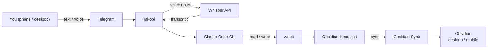

# Obsidian Telegram Agent

Self-hosted Telegram bot that turns your Obsidian vault into an AI-managed knowledge base using Claude Code.

[](LICENSE)

You're reading an article on your phone and want to save it — just forward the link to Telegram. Walking and got an idea — send a voice note. Need to clean up old project notes — tell the bot in plain language. The agent handles capture, summarization, filing, and rewriting so you can stay in the flow instead of switching apps.

Under the hood, Claude Code runs as a full agent with shell access to your vault — not just an API wrapper. It can read, write, search, and refactor your notes the same way you would from a terminal. Obsidian Headless keeps the vault synced to your desktop and mobile apps through Obsidian Sync, so everything you capture through Telegram shows up in Obsidian within seconds.

## Table of contents

- [What it can do](#what-it-can-do)
- [How it works](#how-it-works)
- [Prerequisites](#prerequisites)
- [Quick start](#quick-start)
- [Configuration](#configuration)
- [Sessions and conversation flow](#sessions-and-conversation-flow)
- [Vault isolation](#vault-isolation)
- [Auto-deploy with GitHub Actions](#auto-deploy-with-github-actions)
- [Typical operations](#typical-operations)
- [Troubleshooting](#troubleshooting)
- [Cost estimate](#cost-estimate)
- [Security notes](#security-notes)
- [Roadmap](#roadmap)

## How it works



**Takopi** is a [Telegram bridge for coding agents](https://takopi.dev/). It handles chat routing, session management, and voice-note transcription. Under the hood it shells out to Claude Code CLI, which has direct read/write access to the vault.

**Obsidian Headless** is the official headless Sync client. It keeps the server-side vault in sync with your desktop and mobile Obsidian apps, no GUI required.

Both services run as Docker containers sharing a single `/vault` volume.

## What it can do

- **Capture ideas** — send a quick text or voice note, the agent creates a clean note in your Inbox
- **Save articles** — forward a URL, the agent fetches the page, writes a summary, and files it
- **Voice notes** — speak your thoughts, the agent transcribes, cleans up filler words, and saves
- **Search and retrieve** — ask "what did I write about X?" and get answers grounded in your notes
- **Rewrite and refactor** — "rewrite this note in a more structured way" or "merge these two notes"
- **Organize** — move notes between folders, add tags, update frontmatter, clean up stale content
- **Anything else** — Claude Code has full shell access to the vault, so if you can describe it, it can probably do it

The agent remembers context between messages — you can have a back-and-forth conversation about your notes without re-explaining what you're working on.

## Prerequisites

- A Linux VPS (1 vCPU, 1 GB RAM minimum — see [recommended specs](#recommended-vps-specs))
- A Telegram bot token from [@BotFather](https://t.me/botfather)
- An Anthropic API key ([console.anthropic.com](https://console.anthropic.com/))
- An Obsidian Sync subscription (if you want server-side sync)
- Optionally, an OpenAI API key for voice-note transcription

### Recommended VPS specs

The stack is lightweight — both containers idle most of the time and only consume resources when processing a message.

| Parameter | Minimum | Comfortable |
|---|---|---|
| CPU | 1 vCPU | 2 vCPU |
| RAM | 1 GB | 2 GB |
| Disk | 10 GB SSD | 20 GB SSD |
| OS | Ubuntu 22.04 LTS | Ubuntu 24.04 LTS |

Any VPS provider works (Hetzner, DigitalOcean, Vultr, etc). For best Telegram latency, pick a European DC — Telegram servers are in Amsterdam and London.

## Quick start

### 1. Install Docker on the VPS

```bash
curl -fsSL https://get.docker.com | sh
```

### 2. Clone and configure

```bash
git clone https://github.com/YOUR_USERNAME/obsidian-telegram-agent.git
cd obsidian-telegram-agent
cp .env.example .env
```

Edit `.env` and fill in the three required values:

```
TELEGRAM_BOT_TOKEN=your-token
TELEGRAM_CHAT_ID=your-chat-id
ANTHROPIC_API_KEY=sk-ant-your-key
```

### 3. Start the stack

```bash
docker compose up -d --build
```

### 4. Set up Obsidian Sync (optional, one-time)

```bash
# Log in to your Obsidian account
./scripts/auth-obsidian.sh login

# List your remote vaults
./scripts/auth-obsidian.sh list

# Attach to your vault (use the exact name from the list)
./scripts/auth-obsidian.sh setup "My Vault"

# Pull all files for the first time
docker compose exec obsidian-headless ob sync --path /vault
```

After this, set `OBSIDIAN_AUTOSTART_SYNC=true` in `.env` and restart:

```bash
docker compose up -d
```

From that point on, sync runs continuously and automatically on every container start.

### 5. Test the bot

Send a message in the Telegram chat:

```
look at my files
```

Or try a specific command:

```
create a note in Inbox called "Homelab project ideas"
```

Voice notes work automatically if `VOICE_TRANSCRIPTION_ENABLED=true` and `OPENAI_API_KEY` are set in `.env`.

## Configuration

All configuration is done through environment variables in `.env`. See [`.env.example`](.env.example) for the full list with descriptions.

### Repository layout

```text
.
├─ .github/workflows/
│  └─ deploy.yml            ← auto-deploy on push to main
├─ docker-compose.yml
├─ .env.example
├─ Makefile
├─ scripts/
│  └─ auth-obsidian.sh      ← one-time Obsidian Sync login
├─ takopi/
│  ├─ Dockerfile
│  └─ entrypoint.sh
├─ obsidian-headless/
│  ├─ Dockerfile
│  └─ entrypoint.sh
└─ vault/
   ├─ CLAUDE.md              ← agent instructions (edit to customize behavior)
   └─ templates/
      └─ note.md             ← template for new notes
```

### Agent behavior

The agent's behavior is defined in [`vault/CLAUDE.md`](vault/CLAUDE.md). This file is read by Claude Code at the start of each session. It contains:

- **Vault structure** — PARA folder layout (Projects, Areas, Resources, Archive)
- **Message classification** — how to handle bare URLs, voice notes, quick ideas, explicit commands
- **Capture rules** — where new notes go by default
- **Off-limits paths** — folders the agent must never touch

Edit `CLAUDE.md` to match your vault structure and preferences. After editing, send `/new` in Telegram to start a fresh session that picks up the changes.

### Choosing a model

Sonnet is powerful but expensive. For everyday vault tasks (capturing notes, moving files, summarizing), `claude-haiku-4-5` is ~20x cheaper and fast enough. Set `CLAUDE_MODEL=claude-haiku-4-5` in `.env`. Switch back to Sonnet if you need complex reasoning or long-context rewrites.

## Sessions and conversation flow

This stack uses `session_mode = "chat"`, which means the bot **automatically resumes** the previous Claude session on every new message. You do not need to do anything special — just keep sending messages and Claude remembers the context.

### How it works under the hood

1. You send a message in Telegram.
2. Takopi passes it to `claude -p "your message" --resume <session_id>`.
3. Claude continues the previous conversation, remembering what it did before.
4. Takopi streams Claude's response back to Telegram.

### Useful commands

| Command | What it does |
|---------|-------------|
| `/new` | Clear the session and start fresh |
| `/cancel` | Reply to a progress message to stop the current run |

### Things to keep in mind

- **Context accumulates.** Every message adds to the conversation history. After many messages, Claude's context window fills up, responses slow down, and token costs increase. Use `/new` periodically.
- **`CLAUDE.md` is read once** at the start of each session. If you update `CLAUDE.md`, send `/new` to make Claude pick up the changes.
- **One request at a time.** Takopi serializes requests per session — if you send two messages quickly, the second waits until the first finishes.

## Vault isolation

There are two layers of protection for hiding folders from the agent:

**1. Soft (CLAUDE.md instruction):** list the folder in the `Off-limits paths` section of `vault/CLAUDE.md`. Claude will treat it as if it doesn't exist. Easy to add, but relies on the model following instructions.

**2. Hard (Docker tmpfs):** mount a tmpfs over the folder in `docker-compose.yml`. Claude physically cannot read, list, or write anything there — even if it ignores the instructions.

```yaml
# docker-compose.yml → takopi → tmpfs
tmpfs:
  - "/vault/90 Archive:size=1k,mode=0000"
  - "/vault/My Private Folder:size=1k,mode=0000"
```

`90 Archive/` already uses both layers by default. Obsidian Headless is unaffected and syncs those folders normally.

For maximum safety, use both layers together.

## Auto-deploy with GitHub Actions

Every push to `main` triggers the [deploy workflow](.github/workflows/deploy.yml). It SSHs into the VPS, syncs code, writes `.env` from GitHub Secrets, and runs `docker compose up --build -d`. Telegram notifications are sent on success and failure.

### Required GitHub Secrets

| Secret | Description |
|---|---|
| `VPS_HOST` | IP address or hostname of your VPS |
| `VPS_USER` | SSH username (e.g. `deploy`) |
| `VPS_SSH_KEY` | SSH private key (full contents of `~/.ssh/id_ed25519`) |
| `TELEGRAM_BOT_TOKEN` | Telegram bot token |
| `TELEGRAM_CHAT_ID` | Chat ID where the bot listens |
| `ANTHROPIC_API_KEY` | Anthropic API key |

Optional secrets mirror the `.env` variables — see [`.env.example`](.env.example) for the full list.

To trigger a deploy without a code push: **Actions > Deploy > Run workflow**.

### What persists between deploys

| Path | Contents |
|---|---|
| `./vault/` | Obsidian notes — gitignored, untouched by deploy |
| `./takopi-state/` | Takopi session data — gitignored |
| `./obsidian-state/` | Obsidian Sync auth — gitignored |

## Typical operations

```bash
# Follow logs
docker compose logs -f takopi
docker compose logs -f obsidian-headless

# Check the generated Takopi config
docker compose exec takopi sh -lc 'cat /state/.takopi/takopi.toml'

# Check Obsidian sync status
docker compose exec obsidian-headless ob sync-status --path /vault

# Check container health
docker inspect --format='{{.State.Health.Status}}' takopi
```

Or use the Makefile shortcuts:

```bash
make up       # docker compose up -d --build
make down     # docker compose down
make logs     # docker compose logs -f --tail=200
```

## Troubleshooting

<details>
<summary><strong>Takopi crashes in a restart loop ("error: already running")</strong></summary>

A stale lock file is left from a previous run:

```bash
rm -f ~/obsidian-telegram-agent/takopi-state/.takopi/takopi.lock
docker compose restart takopi
```

</details>

<details>
<summary><strong>Obsidian Sync not pulling files after setup</strong></summary>

`OBSIDIAN_AUTOSTART_SYNC` starts continuous sync, but it does not do an initial pull if the vault is empty. After running `setup`, do a one-time manual sync:

```bash
docker compose exec obsidian-headless ob sync --path /vault
```

Then set `OBSIDIAN_AUTOSTART_SYNC=true` in `.env` and restart.

</details>

<details>
<summary><strong>Triggering a redeploy after updating a secret</strong></summary>

Go to **Actions > Deploy > Run workflow**, or push an empty commit:

```bash
git commit --allow-empty -m "redeploy" && git push
```

</details>

## Cost estimate

This stack uses paid services. Here is a rough monthly estimate for light personal use (~10-20 messages/day):

| Service | Cost | Notes |
|---|---|---|
| VPS | $4-6/mo | Any cheap VPS with 1 vCPU / 1 GB RAM |
| Anthropic API (Haiku) | $1-5/mo | Depends on usage volume |
| Anthropic API (Sonnet) | $5-30/mo | More capable but significantly more expensive |
| Obsidian Sync | $4/mo (billed annually) | Optional; skip if using Git sync |
| OpenAI Whisper | <$1/mo | Only if voice notes are enabled |
| **Total (budget)** | **~$9-15/mo** | Haiku + Obsidian Sync |
| **Total (power user)** | **~$15-40/mo** | Sonnet + heavy usage |

You can bring the cost down by using `claude-haiku-4-5` for everyday tasks and only switching to Sonnet when you need complex reasoning.

## Security notes

- Both containers run as root. This is intentional — Takopi and Claude Code CLI install into `/root/.local/bin` and expect a writable home directory. The containers are single-purpose, have no inbound ports, and only make outbound connections (Telegram API, Claude API, Obsidian Sync). The vault volume is the only shared surface.
- The `curl | bash` pattern is used for installing Claude Code CLI. This is the [official install method](https://docs.anthropic.com/en/docs/claude-code). If this concerns you, review the install script before building.
- Dependencies are pinned to specific versions in the Dockerfiles to prevent unexpected breakage.
- Do not set `CLAUDE_DANGEROUSLY_SKIP_PERMISSIONS=true` unless you fully understand the risks. In this mode Claude can execute any command without confirmation.
- Keep the `CLAUDE_ALLOWED_TOOLS` list narrow.
- Do not let the agent edit `.obsidian/` configuration — this is blocked by default in `CLAUDE.md`.

<details>
<summary><strong>VPS hardening checklist</strong></summary>

After provisioning a fresh VPS:

1. Create a non-root user: `adduser deploy && usermod -aG sudo,docker deploy`
2. Disable root SSH login and password auth in `/etc/ssh/sshd_config`
3. Enable the firewall: `ufw default deny incoming && ufw allow OpenSSH && ufw enable`
4. Enable automatic security updates: `apt install -y unattended-upgrades`
5. If using GitHub Actions deploy, add `deploy ALL=(ALL) NOPASSWD: /usr/bin/docker` to `/etc/sudoers.d/deploy`

No inbound ports are needed — the stack makes only outbound connections.

</details>

## Roadmap

- [ ] Interactive setup wizard (`scripts/install.sh`)
- [ ] One-click deploy for DigitalOcean / Hetzner
- [ ] Safe slash-commands (`/capture`, `/append`, `/summarize`)
- [ ] Git-based sync as an alternative to Obsidian Sync
- [ ] Demo video / asciinema recording

## Acknowledgments

This project would not exist without:

- [**Takopi**](https://takopi.dev/) by [banteg](https://github.com/banteg) — the Telegram-to-agent bridge that powers the entire chat interface. Takopi handles session management, message routing, voice transcription, and streaming — all the hard parts of making a coding agent accessible from a phone.
- [**Obsidian Headless**](https://help.obsidian.md/) by the Obsidian team — the official headless Sync client that makes server-side vault synchronization possible without running a GUI.
- [**Claude Code**](https://docs.anthropic.com/en/docs/claude-code) by Anthropic — the AI agent CLI that does the actual reading, writing, and reasoning over the vault.

## License

[MIT](LICENSE)
